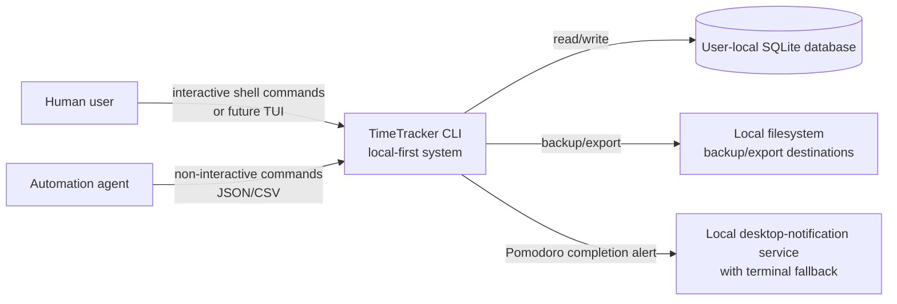
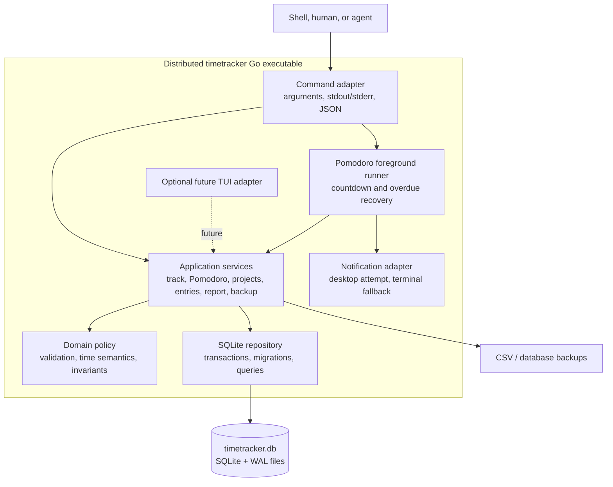

# Local-First TimeTracker CLI — Architecture

**Status:** Proposed
**Depth:** Lightweight C4 context and container views only.

## Architecture principles

- Local first: one user-local database is the v1 system of record.
- Agent first: non-interactive commands and JSON output are first-class.
- One domain layer: future TUI, shell commands, and future import/sync adapters call the same application services.
- Durable invariants: constraints and transactions live in SQLite, not only in command handlers.
- No server dependency: neither normal use nor first-run initialisation needs a network request.

## C4 Level 1 — System context



### Boundary

The v1 boundary ends at the user’s filesystem. The existing Phoenix application is neither called nor required. A future import/export or sync adapter is outside this specification.

## C4 Level 2 — CLI container view



## Responsibilities

| Component | Responsibilities | Must not do |
|---|---|---|
| Command adapter | Parse flags, select output mode, map known errors to exit behavior. | Embed SQL or duplicate domain rules. |
| Pomodoro foreground runner | Render a bounded countdown, request on-time completion, and trigger one completion alert. | Become a persistent daemon or own database rules. |
| Notification adapter | Attempt OS-native desktop notification and provide terminal fallback. | Make persistence conditional on notification delivery. |
| Application services | Orchestrate use cases such as start, stop, edit, Pomodoro, report, export, and backup. | Decide terminal formatting. |
| Domain policy | Validate descriptions/times; define filter and timezone semantics. | Access the filesystem directly. |
| SQLite repository | Run migrations; perform parameterised queries; own transaction boundaries and database constraints. | Print user-facing output. |
| Future TUI adapter | Render state and collect human input. | Establish a second persistence model. |

## Runtime and storage model

```text
installed timetracker binary
        │
        └── opens user-local data directory
                ├── timetracker.db
                ├── timetracker.db-wal   (while WAL is active)
                └── timetracker.db-shm   (while WAL is active)
```

The SQLite engine is linked into the application through its Go driver. There is no separate local daemon and no separately installed SQLite executable requirement.

## Schema outline

```text
projects 1 ─── 0..* time_entries
settings  (key/value local preferences)
```

`projects` retain historical metadata. `time_entries` carry task descriptions, UTC start/stop instants, optional project association, Pomodoro marker, and—when created as an active Pomodoro—a planned duration and scheduled end. The database enforces a single active entry and valid start/stop ordering.

## Concurrency policy

The system is local but can still receive overlapping invocations—for example, an agent and a human terminal command.

- SQLite WAL mode is enabled.
- Every mutation runs in a short transaction.
- A bounded busy timeout handles ordinary lock contention.
- The partial unique constraint for the active entry is the final authority; two concurrent starts cannot create two active timers.
- Conflicts are reported as explicit command failures rather than silently stopping unrelated work.

## Data lifecycle

| Event | Expected behavior |
|---|---|
| First command | Resolve data directory, create it securely, initialise schema and default settings. |
| Normal command | Open DB, migrate forward if needed, reconcile an overdue Pomodoro if present, perform use case, close cleanly. |
| Active Pomodoro | The foreground runner renders remaining time; at its scheduled end, it completes the entry then attempts notification. |
| Interrupted Pomodoro | The next command completes an overdue entry at its stored scheduled end; it does not replay a missed desktop notification. |
| Backup | Use a SQLite-consistent backup mechanism. |
| CSV export | Read selected entries only; no mutation. |
| Upgrade | Apply forward-only, versioned migrations. |
| Uninstall | Never delete user data automatically. |

## Design consequences

- A foreground Pomodoro runner provides reliable in-session notification without introducing a daemon; overdue recovery preserves accurate tracked duration after interruption.
- A TUI is intentionally deferred because it is an adapter, not the domain foundation.
- Sync is intentionally deferred because it changes the consistency and identity model.
- PostgreSQL/PGlite are not required for v1 because the required workload is small, local, relational, and well-served by SQLite.
